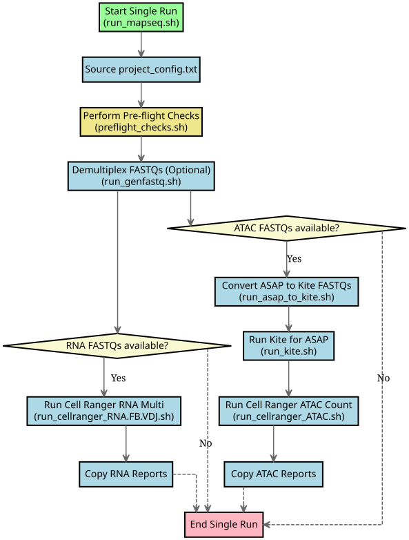
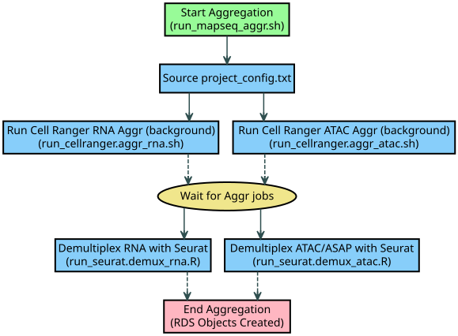

# MAPseq pipeline Quick Start Guide
We recommend this tutorial for users who have a basic understanding of virtual environments, the command line, and single cell sequencing.

## Pre-requisites
- **Data**: The MAPseq technique combines single cell transcriptome sequencing + feature barcoding (and optionally paired immune repertoire profiling) with chromatin accessibility sequencing + bridged hashtagging using the [ASAPseq protocol](https://cite-seq.com/asapseq/). The inputs to this pipeline are either the **demultiplexed gzipped fastq files** or the **non-demultiplexed bcl files from the flowcell**.
- **Compute Resources**: The mapping and analysis of single cell data can be computationally intensive. We recommend using a machine with **at least 8 CPUs and 32GB of RAM** to run the MAPseq pipeline. Additionally, it currently **only supports Linux machines**.
- **Input configuration and reference files**: There are **files that must be modified before each run** to ensure the proper running of the pipeline. These are discussed in further detail below.

## Setting up the Environment

We recommend creating a new conda environment for the installation of the tools required for the MAPseq pipeline and secondary analysis. For external software (not including Cell Ranger), we provide an [`environment_ubuntu-latest.yml`](environment_ubuntu-latest.yml) file for easy installation with conda. This can be run and initialized with:

```
conda env create -f environment_ubuntu-latest.yml
conda activate mapseq_env
```

After installing necessary requirements, you may install the MAPseq pipeline from source using:

```
gh repo clone willisbillis/MAPseq
cd MAPseq
./install.sh
```

It is necessary to reload the shell for changes to take effect after installation. We recommend doing this by closing the current session and opening a new one.

## Running the Pipeline

### Executing a Single Run

Below is a flowchart outlining the steps for executing a single run:

{ style="background-color: white;" }

If working with multiple libraries of the same modality, sometimes it may make sense to combine multiple libraries into a single run. To avoid multiple samples being demultiplexed with the same hashtag, divide the set of libraries into separate runs so that no hashtag is represented multiple times in a single run.

#### 1. Create a new MAPseq run directory
    create_ms_run <RUN_NAME>

#### 2. Modify the Project Config file
Edit the `project_config.txt` file within the `<RUN_NAME>` directory with the following information:

- `DATA_DOWNLOADS_DIR`: The directory where all data downloads are stored.
- `ATAC_DIR`: If ATACseq + ASAPseq data exist, this is directory where the fastqs or bcls are.
- `RNA_DIR`: If RNAseq + Feature Barcoding ( + VDJ) data exist, this is where the fastqs or bcls are.
- `GEX_NAMING_ID`: The shared string in the naming of the fastqs or libraries that identifies the RNAseq libraries.
- `GEX_FEAT_NAMING_ID`: The shared string in the naming of the fastqs or libraries that identifies the Feature Barcoding libraries.
- `VDJ_NAMING_ID`: The shared string in the naming of the fastqs or libraries that identifies the VDJ libraries.
- `ATAC_NAMING_ID`: The shared string in the naming of the fastqs or libraries that identifies the ATACseq libraries.
- `ASAP_NAMING_ID`: The shared string in the naming of the fastqs or libraries that identifies the ASAPseq libraries.
- `GEX_FEAT_REF_PATH`: Path to the RNA Feature Barcoding reference file [formatted for Cell Ranger](https://www.10xgenomics.com/support/software/cell-ranger/latest/analysis/running-pipelines/cr-feature-bc-analysis#feature-ref).
- `ASAP_FEAT_REF_PATH`: Path to the ASAP Feature Barcoding reference file [formatted for Cell Ranger](https://www.10xgenomics.com/support/software/cell-ranger/latest/analysis/running-pipelines/cr-feature-bc-analysis#feature-ref).
- `GEX_REF_PATH`: Path to the transcriptome reference directory. [Download here](https://www.10xgenomics.com/support/software/cell-ranger/downloads#reference-downloads)
- `VDJ_REF_PATH`: Path to the immune repertoire reference directory. [Download here](https://www.10xgenomics.com/support/software/cell-ranger/downloads#reference-downloads)
- `ATAC_REF_PATH`: Path to the epigenome reference directory. [Download here](https://www.10xgenomics.com/support/software/cell-ranger/downloads#reference-downloads)
- `NCPU`: Maximum number of CPUs to use.
- `MEM`: Maximum amount of RAM to use.

#### 3. Populate the Sample Manifest(s)
Whether or not the libraries have been demultiplexed already, each sample within the libraries must be accounted for in the sample manifests, stored in the `<RUN_NAME>/data` directory. Put all RNAseq, Feature Barcoding, and VDJ libraries in the RNA manifest, and ATACseq and ASAPseq libraries in the ATAC manifest. The manifests follow the formatting from the [Cell Ranger simple CSV sample sheet](https://www.10xgenomics.com/support/software/cell-ranger/latest/analysis/inputs/cr-mkfastq#running-with-simple-csv).

#### 4. Run the MAPseq pipeline
From the head of the run directory, `<RUN_NAME>`, run:

    ./run_mapseq.sh

### Aggregating Multiple Runs

Below is a flowchart outlining the steps for aggregating multiple runs:

{ style="background-color: white;" }

After multiple runs from the same project, aggregate the single cell counts from the entire project with the aggregation pipeline. This pipeline also performs basic unsupervised quality control and Seurat object construction.

#### 1. Create a new MAPseq aggr run directory

    create_ms_aggr_run <AGGR_RUN_NAME>

#### 2. Modify the hashtag demultiplexing reference(s)
To assign sample IDs and other metadata to the hashtags, edit the demultiplexing reference tables in the `pipeline` directory of the `<AGGR_RUN_NAME>` project. These are titled `hashtag_ref_rna.csv` and `hashtag_ref_atac.csv`. Here are the options for each column:

**Column Name** | **Description**
:--- | :---
`library_id` | Unique library ID specified in the manifest. This is repeated for each hashtag in the library.
`hashtag` | Hashtag for the sample, matching the hashtag naming found in the Feature Barcoding reference file.
`patient_id` | Patient or sample ID unique to the library and hashtag combination.
`extra columns` | (Optional) If more metadata is available, it may be included in this table to be attached to the cells on aggregation and processing.

#### 3. Run the MAPseq aggregation pipeline
From the head of the aggregation run directory, `<AGGR_RUN_NAME>`, run:

    ./run_mapseq_aggr.sh

## Output and Results
This table lists the directories where outputs can be found from the MAPseq run pipeline
and aggregation run pipeline.

**Directory Path** | **Output** | **Description**
:--- | :--- | :---
`<RUN_NAME>/reports` | `mapping.report_<LIBRARY_NAME>.html` | Cell Ranger single cell mapping report for each library within the run. Quality control metrics like number of cells captured, quality of libraries, and any warnings or errors with the mapping will be found here.
`<RUN_NAME>/reports` | `lane.stats_<PROJECT_NAME>_RNA.html` | Aggregated demultiplexed RNA+FB(+VDJ) read counts by lane of the flowcell. *Only available if library reads were demultiplexed by the MAPseq pipeline.*
`<RUN_NAME>/reports` | `laneBarcode.stats_<RUN_NAME>_RNA.html` | Aggregated demultiplexed RNA+FB(+VDJ) read counts by barcode sequence. Also includes top unknown barcodes. *Only available if library reads were demultiplexed by the MAPseq pipeline.*
`<RUN_NAME>/reports` | `lane.stats_<PROJECT_NAME>_ATAC.html` | Aggregated demultiplexed ATAC+ASAP fragment and read counts by lane of the flowcell. *Only available if library reads were demultiplexed by the MAPseq pipeline.*
`<RUN_NAME>/reports` | `laneBarcode.stats_<RUN_NAME>_ATAC.html` | Aggregated demultiplexed ATAC+ASAP fragment and read counts by barcode sequence. Also includes top unknown barcodes. *Only available if library reads were demultiplexed by the MAPseq pipeline.*
`<RUN_NAME>/pipeline/RNA.FB.VDJ/<LIBRARY_NAME>` | `outs/` | RNA + FB ( + VDJ) Cell Ranger outputs to be fed into single cell analysis software like [Seurat](https://satijalab.org/seurat/).
`<RUN_NAME>/pipeline/ATAC.ASAP/ATAC/<LIBRARY_NAME>` | `outs/` | ATAC Cell Ranger outputs to be fed into single cell analysis software like [Signac](https://stuartlab.org/signac/).
`<RUN_NAME>/pipeline/ATAC.ASAP/ASAP/<LIBRARY_NAME>` | `featurecounts/` | ASAP outputs from the [kite](https://github.com/pachterlab/kite) analysis software. The ASAP reads are processed with the help of [code from Caleb Lareau](https://github.com/caleblareau/asap_to_kite).
`<AGGR_RUN_NAME>/pipeline/RNA.FB.VDJ/<AGGR_RUN_NAME>_aggr` | `outs/`| Cell Ranger aggr outputs to be fed into single cell analysis software like [Seurat](https://satijalab.org/seurat/).
`<AGGR_RUN_NAME>/analysis/RNA.FB.VDJ/data` | `raw_rna.hto.adt_<AGGR_RUN_NAME>.RDS` | Raw non-quality controlled RNA+FB Seurat object.
`<AGGR_RUN_NAME>/analysis/ATAC.ASAP/data` | `raw_atac.hto_<AGGR_RUN_NAME>.RDS` | Raw non-quality controlled ATAC+ASAP Seurat object.
`<AGGR_RUN_NAME>/analysis/ATAC.ASAP` | `library_stats.<AGGR_RUN_NAME>.csv` | ATAC+ASAP demultiplexing statistics table, containing information about number of cells captured from ATAC and ASAP libraries as well as overlap between the two.

## Additional Tips and FAQs
If you have a question, error, or bug to report, please submit a ticket using the [issue page](https://github.com/willisbillis/MAPseq/issues).

### Q1. I only have RNA+FB (or RNA+FB+VDJ or ATAC+ASAP) fastqs. Can I run the MAPseq pipeline still?
**A1: Yes. The MAPseq pipeline is built to detect which modalities have fastqs available to be mapped, such as RNA with or without BCR/TCR profiling as well as solely ATAC+ASAP or solely RNA+FB(+VDJ).**
